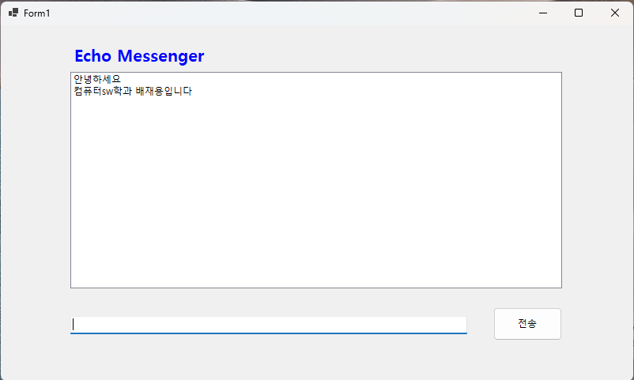
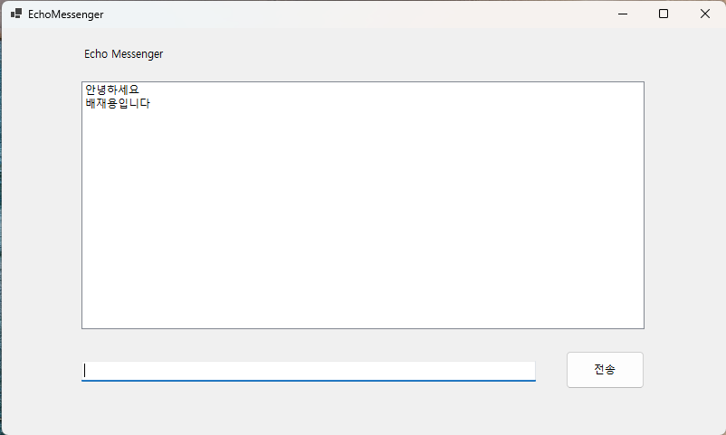

# (C#코딩) 에코 메신저

## 개요
- C# 프로그래밍 학습
- 1줄 소개: 시용자 키보드 입력을 받아서 처리하는 프로그램
- 사용한 플랫폼:
 - C#, .NET Windows Forms, Visual Studio, GitHub
- 사용한 컨트롤:
 - Label, TextBox, Button, ListBox
- 사용한 기술과 구현한 기능:
 - Visual Studio를 사용하여 Windows Forms 애플리케이션 개발
## 실행 화면 (과제1)
- 과제1 코드의 실행 스크린샷

.png)

- 과제 내용
 - label, textbox, button listbox를 배치

## 실행 화면 (과제2)
- 과제2 코드의 실행 스크린샷

.png)
- 과제 내용
 - enter키 입력 시 텍스트박스의 텍스트를 리스트박스에 추가하는 기능 구현
 - 입력창 전송 후 마우스로 입력창을 다시 클릭하지 않아도 되도록 포커스 갖다 놓기
 - 입력창에 메시지를 전송 후 남겨진 메시지 삭제